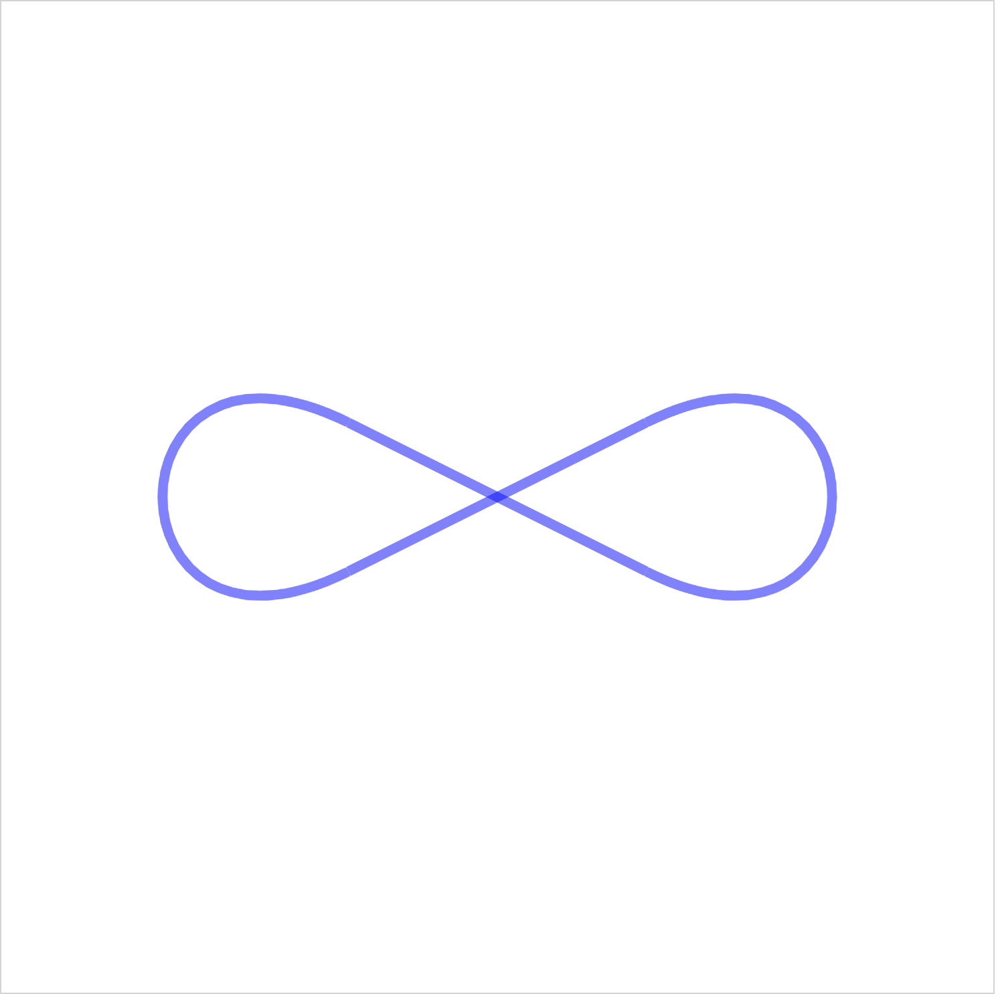

# React SVG

This project was bootstrapped with [Create React App](https://github.com/facebook/create-react-app). The tools used to build this project were learned from reading ['Making an infinity symbol with SVG'](https://medium.com/@batkin/making-an-infinity-symbol-with-svg-6ec50cc8074d) by Benjamin Atkin on [Medium](https://medium.com/). 

